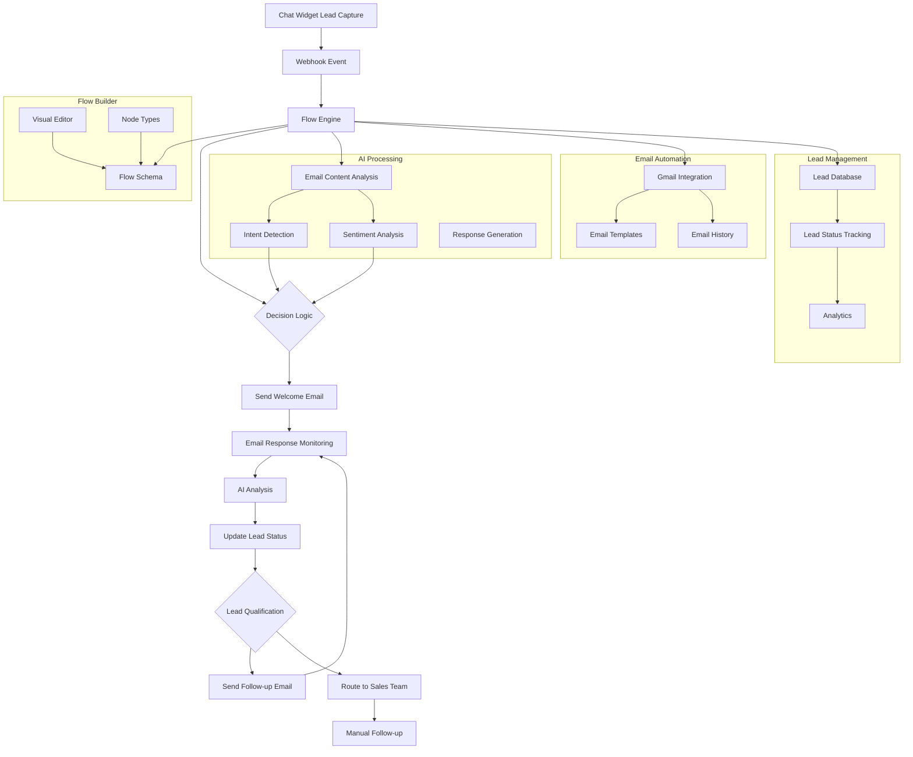

# AI Agent Flow Builder for Email Automation

## Feature Overview

Create a professional, industry-level AI agentic flow builder that automates the entire lead generation to follow-up process using email automation. This feature will enable users to design visual workflows that:

1. **Automatically respond to leads** captured through the chat widget via email
2. **Analyze email responses** using AI to determine intent and sentiment
3. **Update lead statuses** based on email interactions
4. **Send automated follow-up emails** using pre-built templates
5. **Handle complex decision trees** for lead nurturing

**Business Value**: Provides end-to-end lead automation that significantly reduces manual work for sales and marketing teams, improves response times, and increases conversion rates.

**Target Users**: Digital marketing agencies, sales teams, e-commerce businesses, and any user looking to automate their lead nurturing process.

## Architecture Overview



## Core Components

### 1. Flow Builder Module

#### Flow Schema

```typescript
// backend/src/email/flow-builder/flow.schema.ts
export enum FlowNodeType {
  TRIGGER = "trigger",
  ACTION = "action",
  CONDITION = "condition",
  DELAY = "delay",
  END = "end",
}

export enum TriggerType {
  NEW_LEAD = "new_lead",
  EMAIL_RESPONSE = "email_response",
  LEAD_STATUS_CHANGE = "lead_status_change",
}

export enum ActionType {
  SEND_EMAIL = "send_email",
  UPDATE_LEAD_STATUS = "update_lead_status",
  ADD_TAG = "add_tag",
  CREATE_TASK = "create_task",
  WEBHOOK = "webhook",
}

export enum DelayUnit {
  SECONDS = "seconds",
  MINUTES = "minutes",
  HOURS = "hours",
  DAYS = "days",
}

export enum ConditionType {
  LEAD_STATUS = "lead_status",
  EMAIL_RESPONSE_CONTENT = "email_response_content",
  TIME_ELAPSED = "time_elapsed",
  TAG_EXISTS = "tag_exists",
}

@Schema({ timestamps: true })
export class EmailFlow {
  @Prop({ required: true })
  userId: string;

  @Prop({ required: true })
  name: string;

  @Prop({ required: true })
  description?: string;

  @Prop({ type: Object, required: true })
  flowData: {
    nodes: Array<{
      id: string;
      type: FlowNodeType;
      position: { x: number; y: number };
      data: any;
    }>;
    edges: Array<{
      id: string;
      source: string;
      target: string;
      data: any;
    }>;
  };

  @Prop({ default: "platform" }) // 'platform', 'user', 'custom'
  aiApiSource: string;

  @Prop()
  customApiKey?: string;

  @Prop()
  customApiProvider?: string; // 'openai', 'gemini', 'anthropic', etc.

  @Prop({ default: true })
  isActive: boolean;

  @Prop({ default: false })
  isPublished: boolean;

  @Prop({ type: Object })
  stats?: {
    totalRuns: number;
    successfulRuns: number;
    failedRuns: number;
    avgProcessingTime: number;
  };
}
```

#### Flow Builder Service

```typescript
// backend/src/email/flow-builder/flow-builder.service.ts
@Injectable()
export class FlowBuilderService {
  constructor(
    @InjectModel(EmailFlow.name) private flowModel: Model<EmailFlowDocument>,
    private emailFlowEngine: EmailFlowEngine,
    private eventsGateway: EventsGateway,
  ) {}

  async createFlow(userId: string, data: CreateFlowDto): Promise<EmailFlow> {
    const flow = new this.flowModel({
      userId,
      ...data,
      stats: {
        totalRuns: 0,
        successfulRuns: 0,
        failedRuns: 0,
        avgProcessingTime: 0,
      },
    });
    return flow.save();
  }

  async getFlows(userId: string): Promise<EmailFlow[]> {
    return this.flowModel.find({ userId });
  }

  async getFlow(userId: string, flowId: string): Promise<EmailFlow> {
    return this.flowModel.findOne({ _id: flowId, userId });
  }

  async updateFlow(
    userId: string,
    flowId: string,
    data: UpdateFlowDto,
  ): Promise<EmailFlow> {
    return this.flowModel.findByIdAndUpdate(flowId, data, { new: true });
  }

  async deleteFlow(userId: string, flowId: string): Promise<void> {
    await this.flowModel.deleteOne({ _id: flowId, userId });
  }

  async publishFlow(userId: string, flowId: string): Promise<EmailFlow> {
    const flow = await this.getFlow(userId, flowId);
    flow.isPublished = true;
    return flow.save();
  }

  async runFlow(
    flowId: string,
    context: FlowContext,
  ): Promise<FlowExecutionResult> {
    return this.emailFlowEngine.executeFlow(flowId, context);
  }
}
```

### 2. Flow Engine

#### Flow Context & Execution

```typescript
// backend/src/email/flow-builder/types/flow.types.ts
export interface FlowContext {
  userId: string;
  leadId?: string;
  email?: string;
  name?: string;
  emailContent?: string;
  emailAnalysis?: EmailAnalysisResult;
  originalEmailId?: string;
  data?: any;
}

export interface FlowExecutionResult {
  success: boolean;
  flowId: string;
  executionTime: number;
  context: FlowContext;
  result?: any;
  error?: string;
}

export interface SendEmailJobData {
  emailData: {
    to: string;
    subject: string;
    content: string;
    templateId?: string;
    variables?: Record<string, any>;
  };
  context: FlowContext;
}
```

```typescript
// backend/src/email/flow-builder/email-flow-engine.service.ts
@Injectable()
export class EmailFlowEngine {
  constructor(
    private flowBuilderService: FlowBuilderService,
    private gmailService: GmailService,
    private emailTemplatesService: EmailTemplatesService,
    private leadsService: LeadsService,
    private aiAnalysisService: AIAnalysisService,
    private emailHistoryService: EmailHistoryService,
    @InjectQueue("email-flow-queue") private emailFlowQueue: Queue,
  ) {}

  async executeFlow(
    flowId: string,
    context: FlowContext,
  ): Promise<FlowExecutionResult> {
    const startTime = Date.now();
    const flow = await this.flowBuilderService.getFlow(context.userId, flowId);

    if (!flow || !flow.isPublished) {
      throw new BadRequestException("Flow not found or not published");
    }

    try {
      const executionResult = await this.traverseFlow(
        flow.flowData,
        context,
        flow,
      );

      // Update flow stats
      await this.flowBuilderService.updateFlow(context.userId, flowId, {
        stats: {
          ...flow.stats,
          totalRuns: (flow.stats?.totalRuns || 0) + 1,
          successfulRuns: (flow.stats?.successfulRuns || 0) + 1,
          avgProcessingTime: Math.round(
            ((flow.stats?.avgProcessingTime || 0) *
              (flow.stats?.totalRuns || 0) +
              (Date.now() - startTime)) /
              ((flow.stats?.totalRuns || 0) + 1),
          ),
        },
      });

      return {
        success: true,
        flowId,
        executionTime: Date.now() - startTime,
        context,
        result: executionResult,
      };
    } catch (error) {
      // Update flow stats for failed run
      await this.flowBuilderService.updateFlow(context.userId, flowId, {
        stats: {
          ...flow.stats,
          totalRuns: (flow.stats?.totalRuns || 0) + 1,
          failedRuns: (flow.stats?.failedRuns || 0) + 1,
        },
      });

      throw error;
    }
  }

  private async traverseFlow(
    flowData: any,
    context: FlowContext,
    flow: EmailFlow,
  ): Promise<any> {
    // Find start node
    const startNode = flowData.nodes.find(
      (node) => node.type === FlowNodeType.TRIGGER,
    );

    if (!startNode) {
      throw new Error("Flow must have a trigger node");
    }

    return this.processNode(startNode, flowData, context, flow);
  }

  private async processNode(
    node: any,
    flowData: any,
    context: FlowContext,
    flow: EmailFlow,
  ): Promise<any> {
    switch (node.type) {
      case FlowNodeType.TRIGGER:
        return this.processTriggerNode(node, flowData, context, flow);

      case FlowNodeType.ACTION:
        return this.processActionNode(node, flowData, context, flow);

      case FlowNodeType.CONDITION:
        return this.processConditionNode(node, flowData, context, flow);

      case FlowNodeType.DELAY:
        return this.processDelayNode(node, flowData, context, flow);

      case FlowNodeType.END:
        return { completed: true };

      default:
        throw new Error(`Unknown node type: ${node.type}`);
    }
  }

  private async traverseFlow(
    flowData: any,
    context: FlowContext,
  ): Promise<any> {
    // Find start node
    const startNode = flowData.nodes.find(
      (node) => node.type === FlowNodeType.TRIGGER,
    );

    if (!startNode) {
      throw new Error("Flow must have a trigger node");
    }

    return this.processNode(startNode, flowData, context);
  }

  private async processNode(
    node: any,
    flowData: any,
    context: FlowContext,
  ): Promise<any> {
    switch (node.type) {
      case FlowNodeType.TRIGGER:
        return this.processTriggerNode(node, flowData, context);

      case FlowNodeType.ACTION:
        return this.processActionNode(node, flowData, context);

      case FlowNodeType.CONDITION:
        return this.processConditionNode(node, flowData, context);

      case FlowNodeType.DELAY:
        return this.processDelayNode(node, flowData, context);

      case FlowNodeType.END:
        return { completed: true };

      default:
        throw new Error(`Unknown node type: ${node.type}`);
    }
  }

  // Node processing methods would be implemented here
}
```

### 3. AI Analysis Service

#### Email Content Analysis

```typescript
// backend/src/email/flow-builder/ai-analysis.service.ts
@Injectable()
export class AIAnalysisService {
  constructor(private agentsService: AgentsService) {}

  async analyzeEmailContent(
    emailContent: string,
    context: FlowContext,
    flow: EmailFlow,
  ): Promise<EmailAnalysisResult> {
    const analysisPrompt = `
      Analyze the following email content and extract:
      1. Intent - What is the user trying to accomplish? (e.g., request information, ask question, schedule meeting)
      2. Sentiment - Is the tone positive, negative, or neutral?
      3. Key Questions - What specific questions is the user asking?
      4. Next Steps - What should be the appropriate response?
      5. Lead Quality - Is this a qualified lead? (High/Medium/Low)

      Email Content: ${emailContent}
    `;

    try {
      let analysis;

      switch (flow.aiApiSource) {
        case "user":
          // Use user's existing AI agent API key from widget setup
          analysis = await this.agentsService.generateText({
            prompt: analysisPrompt,
            userId: context.userId,
          });
          break;

        case "custom":
          // Use custom API key provided in flow settings
          analysis = await this.generateTextWithCustomApi(
            analysisPrompt,
            flow.customApiKey,
            flow.customApiProvider,
          );
          break;

        case "platform":
        default:
          // Use platform-provided API key
          analysis = await this.generateTextWithPlatformApi(analysisPrompt);
          break;
      }

      // Parse AI response
      const result = this.parseAnalysisResult(analysis);

      return {
        intent: result.intent,
        sentiment: result.sentiment,
        keyQuestions: result.keyQuestions,
        nextSteps: result.nextSteps,
        leadQuality: result.leadQuality,
        rawAnalysis: analysis,
      };
    } catch (error) {
      // Fallback to default analysis if AI fails
      return {
        intent: "general_inquiry",
        sentiment: "neutral",
        keyQuestions: [],
        nextSteps: "Respond with general information",
        leadQuality: "medium",
        rawAnalysis: "AI analysis failed",
      };
    }
  }

  private async generateTextWithCustomApi(
    prompt: string,
    apiKey: string,
    provider: string,
  ): Promise<string> {
    // Implement API calls to different providers
    switch (provider) {
      case "openai":
        return this.callOpenAI(prompt, apiKey);
      case "gemini":
        return this.callGemini(prompt, apiKey);
      case "anthropic":
        return this.callAnthropic(prompt, apiKey);
      default:
        throw new Error(`Unsupported AI provider: ${provider}`);
    }
  }

  private async generateTextWithPlatformApi(prompt: string): Promise<string> {
    // Use platform's default API key
    const platformApiKey = process.env.PLATFORM_AI_API_KEY;
    const platformProvider = process.env.PLATFORM_AI_PROVIDER || "openai";

    return this.generateTextWithCustomApi(
      prompt,
      platformApiKey,
      platformProvider,
    );
  }

  private async callOpenAI(prompt: string, apiKey: string): Promise<string> {
    const response = await axios.post(
      "https://api.openai.com/v1/chat/completions",
      {
        model: "gpt-4",
        messages: [{ role: "user", content: prompt }],
        temperature: 0.7,
      },
      {
        headers: {
          "Content-Type": "application/json",
          Authorization: `Bearer ${apiKey}`,
        },
      },
    );

    return response.data.choices[0].message.content;
  }

  private async callGemini(prompt: string, apiKey: string): Promise<string> {
    const response = await axios.post(
      `https://generativelanguage.googleapis.com/v1/models/gemini-pro:generateContent?key=${apiKey}`,
      {
        contents: [{ parts: [{ text: prompt }] }],
      },
      {
        headers: { "Content-Type": "application/json" },
      },
    );

    return response.data.candidates[0].content.parts[0].text;
  }

  private async callAnthropic(prompt: string, apiKey: string): Promise<string> {
    const response = await axios.post(
      "https://api.anthropic.com/v1/messages",
      {
        model: "claude-3-opus-20240229",
        max_tokens: 1024,
        messages: [{ role: "user", content: prompt }],
      },
      {
        headers: {
          "Content-Type": "application/json",
          "x-api-key": apiKey,
          "anthropic-version": "2023-06-01",
        },
      },
    );

    return response.data.content[0].text;
  }

  private parseAnalysisResult(analysis: string): ParsedAnalysisResult {
    // Parse AI response into structured format
    // This would include logic to extract key information from the AI's text response
    return {
      intent: "general_inquiry",
      sentiment: "neutral",
      keyQuestions: [],
      nextSteps: "Respond with general information",
      leadQuality: "medium",
    };
  }

  async generateEmailResponse(
    emailContent: string,
    analysis: EmailAnalysisResult,
    templateId: string,
    context: FlowContext,
  ): Promise<string> {
    const template = await this.emailTemplatesService.getTemplate(
      context.userId,
      templateId,
    );

    const responsePrompt = `
      Based on the email analysis, generate a response using the provided template:
      
      Email Analysis:
      - Intent: ${analysis.intent}
      - Sentiment: ${analysis.sentiment}
      - Key Questions: ${analysis.keyQuestions.join(", ")}
      - Next Steps: ${analysis.nextSteps}
      - Lead Quality: ${analysis.leadQuality}
      
      Template: ${template.content}
      
      Generated Response:
    `;

    const response = await this.agentsService.generateText({
      prompt: responsePrompt,
      userId: context.userId,
    });

    return response;
  }
}
```

### 4. Flow Execution Queue

#### Background Processing

```typescript
// backend/src/email/flow-builder/email-flow.processor.ts
@Processor("email-flow-queue")
export class EmailFlowProcessor {
  constructor(
    private emailFlowEngine: EmailFlowEngine,
    private eventsGateway: EventsGateway,
  ) {}

  @Process("run-flow")
  @RateLimit({
    max: 100,
    duration: 1000, // 1 second
  })
  async handleRunFlow(job: Job<FlowExecutionJobData>): Promise<void> {
    try {
      const { flowId, context } = job.data;

      this.eventsGateway.sendFlowExecutionUpdate(context.userId, {
        flowId,
        status: "running",
        timestamp: new Date(),
      });

      const result = await this.emailFlowEngine.executeFlow(flowId, context);

      this.eventsGateway.sendFlowExecutionUpdate(context.userId, {
        flowId,
        status: "completed",
        timestamp: new Date(),
        result,
      });
    } catch (error) {
      this.eventsGateway.sendFlowExecutionUpdate(job.data.context.userId, {
        flowId: job.data.flowId,
        status: "failed",
        timestamp: new Date(),
        error: error.message,
      });

      // Retry failed jobs with exponential backoff
      if (job.attemptsMade < 3) {
        const delay = Math.pow(2, job.attemptsMade) * 1000; // 1s, 2s, 4s
        await job.retry(delay);
      }

      throw error;
    }
  }

  @Process("send-email")
  @RateLimit({
    max: 50,
    duration: 1000, // 1 email per 20ms
  })
  async handleSendEmail(job: Job<SendEmailJobData>): Promise<void> {
    try {
      const { emailData, context } = job.data;

      // Send email with rate limiting per user
      await this.emailFlowEngine.sendEmail(emailData, context);
    } catch (error) {
      if (job.attemptsMade < 5) {
        const delay = Math.pow(2, job.attemptsMade) * 1000;
        await job.retry(delay);
      }
      throw error;
    }
  }
}
```

### 5. Frontend Flow Builder

#### AI Configuration Panel

```typescript
// frontend/components/email-automation/flow-builder/AIConfigPanel.tsx
'use client';

import React from 'react';
import {
  Settings,
  Key,
  Globe,
  User,
  Shield,
  ChevronDown,
  ChevronUp
} from 'lucide-react';

interface AIConfigPanelProps {
  aiApiSource: string;
  customApiKey: string;
  customApiProvider: string;
  onAiApiSourceChange: (value: string) => void;
  onCustomApiKeyChange: (value: string) => void;
  onCustomApiProviderChange: (value: string) => void;
}

export function AIConfigPanel({
  aiApiSource,
  customApiKey,
  customApiProvider,
  onAiApiSourceChange,
  onCustomApiKeyChange,
  onCustomApiProviderChange,
}: AIConfigPanelProps) {
  const [isExpanded, setIsExpanded] = React.useState(true);

  return (
    <div className="bg-white rounded-lg border border-gray-200 p-4">
      <div
        className="flex items-center justify-between cursor-pointer mb-4"
        onClick={() => setIsExpanded(!isExpanded)}
      >
        <div className="flex items-center gap-2">
          <Settings className="w-5 h-5 text-indigo-600" />
          <h3 className="font-semibold text-gray-900">AI Configuration</h3>
        </div>
        {isExpanded ? (
          <ChevronUp className="w-4 h-4 text-gray-500" />
        ) : (
          <ChevronDown className="w-4 h-4 text-gray-500" />
        )}
      </div>

      {isExpanded && (
        <div className="space-y-4">
          <div>
            <label className="block text-sm font-medium text-gray-700 mb-2">
              AI API Source
            </label>
            <div className="space-y-2">
              <label className="flex items-center gap-2 p-2 rounded-md border border-gray-200 cursor-pointer hover:bg-gray-50">
                <input
                  type="radio"
                  name="aiApiSource"
                  value="platform"
                  checked={aiApiSource === 'platform'}
                  onChange={(e) => onAiApiSourceChange(e.target.value)}
                  className="w-4 h-4 text-indigo-600 focus:ring-indigo-500"
                />
                <div className="flex items-center gap-2">
                  <Globe className="w-4 h-4 text-indigo-600" />
                  <span className="text-sm text-gray-900">Platform AI (Default)</span>
                </div>
              </label>

              <label className="flex items-center gap-2 p-2 rounded-md border border-gray-200 cursor-pointer hover:bg-gray-50">
                <input
                  type="radio"
                  name="aiApiSource"
                  value="user"
                  checked={aiApiSource === 'user'}
                  onChange={(e) => onAiApiSourceChange(e.target.value)}
                  className="w-4 h-4 text-indigo-600 focus:ring-indigo-500"
                />
                <div className="flex items-center gap-2">
                  <User className="w-4 h-4 text-indigo-600" />
                  <span className="text-sm text-gray-900">My AI Agent API Key</span>
                </div>
              </label>

              <label className="flex items-center gap-2 p-2 rounded-md border border-gray-200 cursor-pointer hover:bg-gray-50">
                <input
                  type="radio"
                  name="aiApiSource"
                  value="custom"
                  checked={aiApiSource === 'custom'}
                  onChange={(e) => onAiApiSourceChange(e.target.value)}
                  className="w-4 h-4 text-indigo-600 focus:ring-indigo-500"
                />
                <div className="flex items-center gap-2">
                  <Shield className="w-4 h-4 text-indigo-600" />
                  <span className="text-sm text-gray-900">Custom API Key</span>
                </div>
              </label>
            </div>
          </div>

          {aiApiSource === 'custom' && (
            <div className="space-y-3 p-3 bg-gray-50 rounded-md">
              <div>
                <label className="block text-sm font-medium text-gray-700 mb-1">
                  AI Provider
                </label>
                <select
                  value={customApiProvider}
                  onChange={(e) => onCustomApiProviderChange(e.target.value)}
                  className="w-full px-3 py-2 border border-gray-300 rounded-md focus:outline-none focus:ring-2 focus:ring-indigo-500 focus:border-transparent text-sm"
                >
                  <option value="openai">OpenAI GPT-4</option>
                  <option value="gemini">Google Gemini</option>
                  <option value="anthropic">Anthropic Claude</option>
                </select>
              </div>

              <div>
                <label className="block text-sm font-medium text-gray-700 mb-1">
                  API Key
                </label>
                <div className="relative">
                  <Key className="absolute left-3 top-1/2 transform -translate-y-1/2 w-4 h-4 text-gray-400" />
                  <input
                    type="password"
                    value={customApiKey}
                    onChange={(e) => onCustomApiKeyChange(e.target.value)}
                    placeholder="Enter your API key"
                    className="w-full pl-10 pr-3 py-2 border border-gray-300 rounded-md focus:outline-none focus:ring-2 focus:ring-indigo-500 focus:border-transparent text-sm"
                  />
                </div>
              </div>
            </div>
          )}

          <div className="text-xs text-gray-500">
            <p>
              The AI will use this configuration for analyzing email responses and generating
              automated replies based on your workflow.
            </p>
          </div>
        </div>
      )}
    </div>
  );
}
```

#### Send Email Node Properties

```typescript
// frontend/components/email-automation/flow-builder/SendEmailNodeProperties.tsx
'use client';

import React from 'react';
import { Mail, Clock, Template, User } from 'lucide-react';

interface SendEmailNodePropertiesProps {
  node: any;
  onUpdate: (updates: any) => void;
}

export function SendEmailNodeProperties({
  node,
  onUpdate,
}: SendEmailNodePropertiesProps) {
  return (
    <div className="space-y-4">
      <div className="flex items-center gap-2 mb-4">
        <Mail className="w-5 h-5 text-indigo-600" />
        <h3 className="font-semibold text-gray-900">Send Email Action</h3>
      </div>

      <div>
        <label className="block text-sm font-medium text-gray-700 mb-2">
          Email Template
        </label>
        <select
          value={node.data.templateId || ''}
          onChange={(e) => onUpdate({ 'data.templateId': e.target.value })}
          className="w-full px-3 py-2 border border-gray-300 rounded-md focus:outline-none focus:ring-2 focus:ring-indigo-500 text-sm"
        >
          <option value="">Select a template...</option>
          <option value="welcome">Welcome Email</option>
          <option value="follow-up">Follow-up Email</option>
          <option value="thank-you">Thank You Email</option>
        </select>
      </div>

      <div>
        <label className="block text-sm font-medium text-gray-700 mb-2">
          Send Delay
        </label>
        <div className="flex gap-2">
          <input
            type="number"
            min="0"
            value={node.data.delayValue || 0}
            onChange={(e) => onUpdate({ 'data.delayValue': parseInt(e.target.value) })}
            placeholder="0"
            className="w-20 px-3 py-2 border border-gray-300 rounded-md focus:outline-none focus:ring-2 focus:ring-indigo-500 text-sm"
          />
          <select
            value={node.data.delayUnit || 'minutes'}
            onChange={(e) => onUpdate({ 'data.delayUnit': e.target.value })}
            className="flex-1 px-3 py-2 border border-gray-300 rounded-md focus:outline-none focus:ring-2 focus:ring-indigo-500 text-sm"
          >
            <option value="seconds">Seconds</option>
            <option value="minutes">Minutes</option>
            <option value="hours">Hours</option>
            <option value="days">Days</option>
          </select>
        </div>
        <p className="text-xs text-gray-500 mt-1">
          Delay before sending this email (0 = immediate)
        </p>
      </div>

      <div>
        <label className="block text-sm font-medium text-gray-700 mb-2">
          Email Variables
        </label>
        <div className="space-y-2">
          <label className="flex items-center gap-2">
            <input
              type="checkbox"
              checked={node.data.includeName || true}
              onChange={(e) => onUpdate({ 'data.includeName': e.target.checked })}
              className="w-4 h-4 text-indigo-600 focus:ring-indigo-500"
            />
            <span className="text-sm text-gray-900">Include recipient name</span>
          </label>
          <label className="flex items-center gap-2">
            <input
              type="checkbox"
              checked={node.data.includeCompany || false}
              onChange={(e) => onUpdate({ 'data.includeCompany': e.target.checked })}
              className="w-4 h-4 text-indigo-600 focus:ring-indigo-500"
            />
            <span className="text-sm text-gray-900">Include company name</span>
          </label>
        </div>
      </div>

      <div className="pt-3 border-t border-gray-200">
        <div className="text-xs text-gray-500">
          <p>
            This email will be sent to the lead captured from your chat widget.
            You can customize the content and timing in your email templates.
          </p>
        </div>
      </div>
    </div>
  );
}
```

#### Visual Editor Component

```typescript
// frontend/components/email-automation/flow-builder/FlowBuilder.tsx
'use client';

import React, { useState, useCallback, useRef } from 'react';
import ReactFlow, {
  Background,
  Controls,
  MiniMap,
  ReactFlowProvider,
  addEdge,
  useNodesState,
  useEdgesState,
  Handle,
  Position
} from 'reactflow';
import 'reactflow/dist/style.css';
import { NodePanel } from './NodePanel';
import { FlowToolbar } from './FlowToolbar';
import { FlowNodeTypes } from '@/types/flow-builder';

const initialNodes = [
  {
    id: '1',
    type: 'triggerNode',
    position: { x: 250, y: 0 },
    data: { label: 'New Lead Trigger' },
  },
];

const initialEdges = [];

export function FlowBuilder() {
  const reactFlowWrapper = useRef<HTMLDivElement>(null);
  const [nodes, setNodes, onNodesChange] = useNodesState(initialNodes);
  const [edges, setEdges, onEdgesChange] = useEdgesState(initialEdges);
  const [reactFlowInstance, setReactFlowInstance] = useState<any>(null);
  const [selectedNode, setSelectedNode] = useState<any>(null);

  const onConnect = useCallback(
    (params: any) => setEdges((eds) => addEdge({ ...params, animated: true, style: { stroke: '#555' } }, eds)),
    [setEdges],
  );

  const onDragOver = useCallback((event: React.DragEvent) => {
    event.preventDefault();
    event.dataTransfer.dropEffect = 'move';
  }, []);

  const onDrop = useCallback(
    (event: React.DragEvent) => {
      event.preventDefault();

      const type = event.dataTransfer.getData('application/reactflow');

      if (typeof type === 'undefined' || !type) {
        return;
      }

      const position = reactFlowInstance.screenToFlowPosition({
        x: event.clientX,
        y: event.clientY,
      });

      const newNode = {
        id: `${type}-${Date.now()}`,
        type,
        position,
        data: { label: `${type} Node` },
      };

      setNodes((nds) => nds.concat(newNode));
    },
    [reactFlowInstance, setNodes],
  );

  const onNodeClick = useCallback((_: React.MouseEvent, node: any) => {
    setSelectedNode(node);
  }, []);

  const onPaneClick = useCallback(() => {
    setSelectedNode(null);
  }, []);

  const nodeTypes = {
    triggerNode: TriggerNode,
    actionNode: ActionNode,
    conditionNode: ConditionNode,
    delayNode: DelayNode,
    endNode: EndNode,
  };

  return (
    <div className="h-screen flex flex-col">
      <FlowToolbar
        nodes={nodes}
        edges={edges}
        onSave={handleSave}
        onPublish={handlePublish}
      />
      <div className="flex-1 flex">
        <NodePanel />
        <div className="flex-1 relative" ref={reactFlowWrapper}>
          <ReactFlow
            nodes={nodes}
            edges={edges}
            onNodesChange={onNodesChange}
            onEdgesChange={onEdgesChange}
            onConnect={onConnect}
            onInit={setReactFlowInstance}
            onDrop={onDrop}
            onDragOver={onDragOver}
            onNodeClick={onNodeClick}
            onPaneClick={onPaneClick}
            nodeTypes={nodeTypes}
            fitView
          >
            <Background />
            <Controls />
            <MiniMap />
          </ReactFlow>
        </div>
        {selectedNode && (
          <NodePropertiesPanel
            node={selectedNode}
            onUpdate={handleNodeUpdate}
          />
        )}
      </div>
    </div>
  );
}

// Custom node components would be implemented here
```

## Integration Points

### 1. Webhook Integration

```typescript
// backend/src/webhooks/webhooks.service.ts - Updated to support flow triggers
async handleWebhookEvent(event: WebhookEvent): Promise<void> {
  switch (event.type) {
    case WebhookEventType.LEAD_CREATED:
      // Find all active email flows with new lead trigger
      const newLeadFlows = await this.flowBuilderService.getFlows(event.userId);
      const activeNewLeadFlows = newLeadFlows.filter(flow =>
        flow.isActive &&
        flow.isPublished &&
        flow.flowData.nodes.some(node =>
          node.type === FlowNodeType.TRIGGER &&
          node.data.triggerType === TriggerType.NEW_LEAD
        )
      );

      // Queue flow execution for each matching flow
      for (const flow of activeNewLeadFlows) {
        await this.flowQueueService.add('run-flow', {
          flowId: flow._id.toString(),
          context: {
            userId: event.userId,
            leadId: event.data.leadId,
            email: event.data.email,
            name: event.data.name,
            data: event.data
          }
        });
      }
      break;

    // Other event types...
  }
}
```

### 2. Email Response Monitoring

```typescript
// backend/src/email/gmail.service.ts - Updated to monitor for replies
async monitorEmailReplies(): Promise<void> {
  // Check for new emails in users' inboxes
  const users = await this.getActiveUsersWithConnectedAccounts();

  for (const user of users) {
    const newEmails = await this.getNewEmails(user);

    for (const email of newEmails) {
      // Check if this email is a reply to any of our sent emails
      const originalEmail = await this.emailHistoryService.findOriginalEmail(email);

      if (originalEmail) {
        // Find lead associated with this email
        const lead = await this.leadsService.findByEmail(email.sender);

        if (lead) {
          // Analyze email content
          const analysis = await this.aiAnalysisService.analyzeEmailContent(email.body, {
            userId: user._id.toString(),
            leadId: lead._id.toString(),
            email: email.sender
          });

          // Find and run relevant email response flows
          const responseFlows = await this.flowBuilderService.getFlows(user._id.toString());
          const activeResponseFlows = responseFlows.filter(flow =>
            flow.isActive &&
            flow.isPublished &&
            flow.flowData.nodes.some(node =>
              node.type === FlowNodeType.TRIGGER &&
              node.data.triggerType === TriggerType.EMAIL_RESPONSE
            )
          );

          for (const flow of activeResponseFlows) {
            await this.flowQueueService.add('run-flow', {
              flowId: flow._id.toString(),
              context: {
                userId: user._id.toString(),
                leadId: lead._id.toString(),
                email: email.sender,
                emailContent: email.body,
                emailAnalysis: analysis,
                originalEmailId: originalEmail._id.toString()
              }
            });
          }
        }
      }
    }
  }
}
```

## Implementation Timeline

### Phase 1: Flow Builder Foundation (6 days)

- [ ] Create flow schema and database models
- [ ] Implement FlowBuilderService with CRUD operations
- [ ] Set up flow execution queue with BullMQ configuration
- [ ] Create basic flow engine framework
- [ ] Implement AI API source configuration (platform, user, custom)

### Phase 2: Node Types Implementation (7 days)

- [ ] Implement trigger node types (new lead, email response, status change)
- [ ] Implement action node types (send email, update status, add tag, webhook)
- [ ] Implement condition node types (status check, content analysis, time elapsed)
- [ ] Implement delay and end nodes with time interval support
- [ ] Add time unit configuration (seconds, minutes, hours, days)

### Phase 3: AI Analysis Integration (5 days)

- [ ] Create AIAnalysisService with multi-API support
- [ ] Implement email content analysis with platform, user, and custom API options
- [ ] Add intent and sentiment detection
- [ ] Implement response generation with template support
- [ ] Add error handling and fallback mechanisms

### Phase 4: Flow Engine Development (8 days)

- [ ] Complete flow traversal logic
- [ ] Implement node processing methods
- [ ] Add error handling and retry mechanisms
- [ ] Implement flow execution stats tracking
- [ ] Optimize for high concurrency with queue configuration
- [ ] Add rate limiting and backoff strategies

### Phase 5: Frontend Flow Builder (12 days)

- [ ] Create ReactFlow-based visual editor
- [ ] Implement node panel and properties panel
- [ ] Add AI configuration panel with API source selection
- [ ] Implement send email node properties with time interval settings
- [ ] Add flow toolbar with save, publish, and export functionality
- [ ] Implement drag-and-drop node creation
- [ ] Add flow validation and error checking

### Phase 6: Integration & Testing (9 days)

- [ ] Integrate with webhook system
- [ ] Integrate with email monitoring service
- [ ] Test flow execution with various scenarios
- [ ] Add comprehensive error handling
- [ ] Performance optimization
- [ ] Load testing with 1000+ concurrent requests

### Phase 7: UI/UX Polish (4 days)

- [ ] Add flow execution history and analytics
- [ ] Implement real-time flow execution updates
- [ ] Add flow templates and examples
- [ ] Polish user interface

### Phase 1: Flow Builder Foundation (4 days)

- [ ] Create flow schema and database models
- [ ] Implement FlowBuilderService with CRUD operations
- [ ] Set up flow execution queue
- [ ] Create basic flow engine framework

### Phase 2: Node Types Implementation (5 days)

- [ ] Implement trigger node types (new lead, email response, status change)
- [ ] Implement action node types (send email, update status, add tag, webhook)
- [ ] Implement condition node types (status check, content analysis, time elapsed)
- [ ] Implement delay and end nodes

### Phase 3: AI Analysis Integration (3 days)

- [ ] Create AIAnalysisService
- [ ] Implement email content analysis
- [ ] Add intent and sentiment detection
- [ ] Implement response generation

### Phase 4: Flow Engine Development (6 days)

- [ ] Complete flow traversal logic
- [ ] Implement node processing methods
- [ ] Add error handling and retry mechanisms
- [ ] Implement flow execution stats tracking

### Phase 5: Frontend Flow Builder (10 days)

- [ ] Create ReactFlow-based visual editor
- [ ] Implement node panel and properties panel
- [ ] Add flow toolbar with save, publish, and export functionality
- [ ] Implement drag-and-drop node creation
- [ ] Add flow validation and error checking

### Phase 6: Integration & Testing (7 days)

- [ ] Integrate with webhook system
- [ ] Integrate with email monitoring service
- [ ] Test flow execution with various scenarios
- [ ] Add comprehensive error handling
- [ ] Performance optimization

### Phase 7: UI/UX Polish (3 days)

- [ ] Add flow execution history and analytics
- [ ] Implement real-time flow execution updates
- [ ] Add flow templates and examples
- [ ] Polish user interface

## Frontend Pages

### 1. Flow Builder Dashboard

```typescript
// frontend/app/dashboard/email-automation/flows/page.tsx
export default function EmailAutomationFlowsPage() {
  return (
    <div className="space-y-6">
      <div className="flex justify-between items-center">
        <div>
          <h1 className="text-2xl font-bold text-black">Email Automation Flows</h1>
          <p className="text-gray-600">Design and manage your email automation workflows</p>
        </div>
        <Link
          href="/dashboard/email-automation/flows/new"
          className="bg-gradient-to-r from-indigo-500 to-purple-600 text-white px-6 py-2 rounded-lg font-medium hover:shadow-lg transition-all duration-200"
        >
          + Create New Flow
        </Link>
      </div>

      {/* Flow List */}
      <FlowList />

      {/* Recent Executions */}
      <RecentExecutions />
    </div>
  );
}
```

### 2. Flow Builder Editor

```typescript
// frontend/app/dashboard/email-automation/flows/new/page.tsx
import { FlowBuilder } from '@/components/email-automation/flow-builder/FlowBuilder';

export default function NewFlowPage() {
  return (
    <div className="h-screen">
      <FlowBuilder />
    </div>
  );
}
```

### 3. Flow Execution Analytics

```typescript
// frontend/app/dashboard/email-automation/flows/[id]/analytics/page.tsx
export default function FlowAnalyticsPage({ params }: { params: { id: string } }) {
  const { data: flowData } = useQuery({
    queryKey: ['emailFlow', params.id],
    queryFn: () => api.getEmailFlow(params.id),
  });

  const { data: executionsData } = useQuery({
    queryKey: ['flowExecutions', params.id],
    queryFn: () => api.getFlowExecutions(params.id),
  });

  return (
    <div className="space-y-6">
      <FlowHeader flow={flowData} />

      <div className="grid grid-cols-1 lg:grid-cols-2 gap-6">
        <FlowStatsCard flow={flowData} />
        <ExecutionChart data={executionsData} />
      </div>

      <ExecutionList data={executionsData} />
    </div>
  );
}
```

## Queue Configuration

### BullMQ Configuration

```typescript
// backend/src/email/flow-builder/flow-builder.module.ts
@Module({
  imports: [
    MongooseModule.forFeature([
      { name: EmailFlow.name, schema: EmailFlowSchema },
    ]),
    BullModule.registerQueue({
      name: "email-flow-queue",
      redis: {
        host: process.env.REDIS_HOST || "localhost",
        port: parseInt(process.env.REDIS_PORT) || 6379,
      },
      defaultJobOptions: {
        attempts: 3,
        backoff: {
          type: "exponential",
          delay: 1000, // 1 second
        },
        removeOnComplete: true,
        removeOnFail: 3,
      },
      limiter: {
        max: 1000,
        duration: 60000, // 60 seconds
        bounceBack: false,
      },
    }),
  ],
  providers: [
    FlowBuilderService,
    EmailFlowEngine,
    AIAnalysisService,
    EmailFlowProcessor,
  ],
  controllers: [FlowBuilderController],
  exports: [FlowBuilderService, EmailFlowEngine, AIAnalysisService],
})
export class FlowBuilderModule {}
```

### Queue Monitoring

```typescript
// backend/src/email/flow-builder/queue-monitoring.service.ts
@Injectable()
export class QueueMonitoringService {
  private readonly logger = new Logger(QueueMonitoringService.name);
  private monitoringInterval: NodeJS.Timeout | null = null;

  constructor(@InjectQueue("email-flow-queue") private emailFlowQueue: Queue) {}

  async onModuleInit() {
    this.startMonitoring();
  }

  async onModuleDestroy() {
    if (this.monitoringInterval) {
      clearInterval(this.monitoringInterval);
    }
  }

  private startMonitoring() {
    this.monitoringInterval = setInterval(async () => {
      try {
        const jobCounts = await this.emailFlowQueue.getJobCounts();

        this.logger.log(`Queue Status: 
          Active: ${jobCounts.active} | 
          Waiting: ${jobCounts.waiting} | 
          Delayed: ${jobCounts.delayed} | 
          Completed: ${jobCounts.completed} | 
          Failed: ${jobCounts.failed}`);

        // Alert if queue is backed up
        if (jobCounts.waiting > 1000) {
          this.logger.warn(
            `High queue backlog: ${jobCounts.waiting} jobs waiting`,
          );
        }

        if (jobCounts.failed > 100) {
          this.logger.warn(
            `High failure rate: ${jobCounts.failed} failed jobs`,
          );
        }
      } catch (error) {
        this.logger.error("Error monitoring queue:", error);
      }
    }, 30000); // Check every 30 seconds
  }

  async getQueueStats(): Promise<QueueStats> {
    const jobCounts = await this.emailFlowQueue.getJobCounts();
    const queueMetrics = await this.emailFlowQueue.getMetrics();

    return {
      jobCounts,
      activeWorkers: queueMetrics.workers.length,
      processed: queueMetrics.processed,
      failed: queueMetrics.failed,
      processedLastMinute: queueMetrics.processedLastMinute,
    };
  }
}
```

## Database Updates

### 1. Flow Collection

```typescript
// backend/src/email/flow-builder/flow-builder.module.ts
@Module({
  imports: [
    MongooseModule.forFeature([
      { name: EmailFlow.name, schema: EmailFlowSchema },
    ]),
    BullModule.registerQueue({
      name: "email-flow-queue",
    }),
  ],
  providers: [
    FlowBuilderService,
    EmailFlowEngine,
    AIAnalysisService,
    EmailFlowProcessor,
  ],
  controllers: [FlowBuilderController],
  exports: [FlowBuilderService, EmailFlowEngine, AIAnalysisService],
})
export class FlowBuilderModule {}
```

### 2. Email History Enhancements

```typescript
// backend/src/email/email-history.schema.ts - Updated
@Schema({ timestamps: true })
export class EmailHistory {
  // Existing fields...

  @Prop()
  flowId?: string;

  @Prop()
  flowNodeId?: string;

  @Prop({ type: Object })
  aiAnalysis?: {
    intent: string;
    sentiment: string;
    keyQuestions: string[];
    nextSteps: string;
    leadQuality: string;
  };
}
```

## Security & Compliance

### 1. Data Validation

- Validate flow configurations before execution
- Sanitize user inputs in flow definitions
- Validate node connections and structure

### 2. Rate Limiting

- Limit flow execution frequency per user
- Implement rate limiting on flow API endpoints
- Prevent abuse of email sending limits

### 3. Error Handling

- Comprehensive error tracking and reporting
- Retry failed flow executions with exponential backoff
- Alert users to failing flows via email

## Analytics & Reporting

### 1. Flow Execution Metrics

- Total runs per flow
- Success/failure rates
- Average processing time
- Node execution counts

### 2. Email Performance Metrics

- Open rates
- Click-through rates
- Response rates
- Lead conversion rates

### 3. AI Analysis Metrics

- Intent detection accuracy
- Sentiment analysis distribution
- Response quality ratings

## Testing Strategy

### 1. Unit Tests

- Test individual node types and processing logic
- Test AI analysis service
- Test flow engine traversal

### 2. Integration Tests

- Test flow execution from webhook to email send
- Test email response monitoring and processing
- Test flow engine integration with existing services

### 3. E2E Tests

- Test flow creation and execution workflow
- Test various flow configurations
- Test error handling and recovery scenarios

## Deployment Strategy

### 1. Database Migration

- Add new collections for flows and flow executions
- Add indexes for flow performance optimization
- Update existing email history documents

### 2. Infrastructure

- Ensure email monitoring service has sufficient resources
- Scale flow execution queue based on demand
- Monitor AI analysis service performance

### 3. Rollback Strategy

- Implement flow versioning
- Allow reverting to previous flow versions
- Test rollback procedures

## Conclusion

The AI Agent Flow Builder for email automation will provide users with a powerful tool to automate their lead nurturing process from start to finish. By combining visual workflow design with AI-powered email analysis and response generation, users can create sophisticated automation sequences that save time and improve conversion rates.

This feature follows the existing architectural patterns of the platform, leveraging the existing AI agent system, email automation infrastructure, and webhook integration. The implementation is designed to be modular and extensible, allowing for future enhancements such as SMS automation, social media integration, and more complex decision logic.
