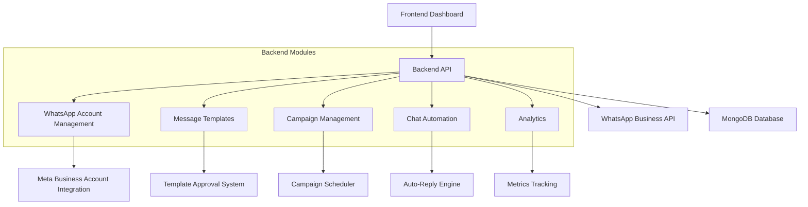

# WhatsApp Automation Implementation Plan

## Overview

This plan outlines the implementation of a comprehensive WhatsApp automation system that allows users to connect their WhatsApp Business Accounts, create and send WhatsApp messages and campaigns, and track engagement metrics.

## Architecture Diagram



## Implementation Steps

### 1. Backend Setup

#### 1.1 Create WhatsApp Module Structure

```
backend/src/whatsapp/
├── whatsapp.module.ts          # Main module file
├── meta-whatsapp-api.ts       # Meta WhatsApp Business API integration
├── whatsapp-account.service.ts # Account management service
├── whatsapp-account.schema.ts  # Account schema
├── whatsapp-templates.service.ts # Templates management
├── whatsapp-templates.schema.ts  # Templates schema
├── whatsapp-campaigns.service.ts # Campaigns management
├── whatsapp-campaigns.schema.ts  # Campaigns schema
├── whatsapp-chat.service.ts   # Chat automation
├── whatsapp-chat.schema.ts    # Chat history schema
├── whatsapp-analytics.service.ts # Analytics service
├── whatsapp.controller.ts     # API endpoints
└── dto/                       # Data transfer objects
    ├── connect-account.dto.ts
    ├── create-template.dto.ts
    ├── create-campaign.dto.ts
    └── send-message.dto.ts
```

#### 1.2 Implement Meta WhatsApp API Integration

- Create `MetaWhatsAppAPI` service with methods:
  - `sendTemplateMessage()` - Send template messages
  - `sendMessage()` - Send text messages
  - `sendInteractiveMessage()` - Send interactive messages (lists, buttons)
  - `getTemplates()` - Retrieve approved templates
  - `createTemplate()` - Create new message template
  - `updateTemplate()` - Update existing template
  - `deleteTemplate()` - Delete template
  - `verifyWebhook()` - Webhook verification
  - `parseWebhookEvent()` - Webhook event processing

#### 1.3 WhatsApp Account Management

- Create `WhatsAppAccount` schema with fields:
  - `userId` - User reference
  - `phoneNumber` - WhatsApp phone number
  - `phoneNumberId` - Meta phone number ID
  - `accessToken` - Meta API access token
  - `businessName` - Business name
  - `whatsappBusinessAccountId` - WhatsApp Business Account ID
  - `isActive` - Account status

- Implement `WhatsAppAccountService` with:
  - `connectAccount()` - Connect user's WhatsApp Business Account
  - `disconnectAccount()` - Disconnect account
  - `getByUserId()` - Get user's connected account
  - `validateAccount()` - Validate account credentials

#### 1.4 Message Templates Management

- Create `WhatsAppTemplate` schema with fields:
  - `userId` - User reference
  - `templateName` - Template name
  - `languageCode` - Language code (e.g., en_US)
  - `category` - Template category (marketing, utility, authentication)
  - `components` - Template components (header, body, footer, buttons)
  - `status` - Approval status (pending, approved, rejected)

- Implement `WhatsAppTemplatesService` with:
  - `getTemplates()` - Get user's templates
  - `createTemplate()` - Create new template
  - `updateTemplate()` - Update template
  - `deleteTemplate()` - Delete template
  - `validateTemplate()` - Validate template before sending

#### 1.5 Campaign Management

- Create `WhatsAppCampaign` schema with fields:
  - `userId` - User reference
  - `name` - Campaign name
  - `description` - Campaign description
  - `templateId` - Template reference
  - `contactList` - Array of recipient phone numbers
  - `scheduledAt` - Scheduled send time
  - `status` - Campaign status (draft, scheduled, sending, sent, paused)
  - `metrics` - Campaign metrics (sent, delivered, read, failed)

- Implement `WhatsAppCampaignsService` with:
  - `createCampaign()` - Create new campaign
  - `getCampaigns()` - Get user's campaigns
  - `updateCampaign()` - Update campaign
  - `deleteCampaign()` - Delete campaign
  - `sendCampaign()` - Send campaign
  - `scheduleCampaign()` - Schedule campaign
  - `pauseCampaign()` - Pause campaign

#### 1.6 Chat Automation

- Create `WhatsAppChatSession` schema with fields:
  - `userId` - User reference
  - `from` - Sender phone number
  - `sessionId` - Unique session identifier
  - `messages` - Array of messages
  - `lastActive` - Last activity time
  - `status` - Session status (active, closed)

- Implement `WhatsAppChatService` with:
  - `handleIncomingMessage()` - Process incoming messages
  - `sendAutoReply()` - Send automated replies
  - `createChatSession()` - Create new chat session
  - `getChatSessions()` - Get user's chat sessions
  - `getChatHistory()` - Get chat history

#### 1.7 Analytics & Reporting

- Create `WhatsAppAnalytics` schema with fields:
  - `userId` - User reference
  - `campaignId` - Campaign reference
  - `messageId` - Message reference
  - `to` - Recipient phone number
  - `status` - Message status (sent, delivered, read, failed)
  - `timestamp` - Message timestamp
  - `responseTime` - Time taken to respond (if applicable)

- Implement `WhatsAppAnalyticsService` with:
  - `trackMessageStatus()` - Track message status updates
  - `getCampaignAnalytics()` - Get campaign performance metrics
  - `getContactAnalytics()` - Get contact engagement metrics
  - `generateReport()` - Generate analytics report
  - `exportReport()` - Export report in CSV/PDF format

#### 1.8 API Endpoints

- Create `WhatsAppController` with endpoints:
  - `/whatsapp/accounts` - Account management
  - `/whatsapp/templates` - Template management
  - `/whatsapp/campaigns` - Campaign management
  - `/whatsapp/chats` - Chat management
  - `/whatsapp/analytics` - Analytics endpoints
  - `/whatsapp/webhook` - Webhook endpoint for Meta callbacks

### 2. Frontend Implementation

#### 2.1 Create Frontend Structure

```
frontend/app/dashboard/whatsapp-automation/
├── page.tsx                   # Main dashboard
├── sidebar-menu.tsx          # Sidebar navigation
├── accounts/
│   └── page.tsx             # Account connection
├── templates/
│   └── page.tsx             # Template management
├── campaigns/
│   └── page.tsx             # Campaign management
├── chats/
│   └── page.tsx             # Chat history and automation
├── analytics/
│   └── page.tsx             # Analytics and reporting
└── components/              # Reusable components
    ├── AccountConnectionForm.tsx
    ├── TemplateEditor.tsx
    ├── CampaignCreator.tsx
    ├── ChatInterface.tsx
    └── AnalyticsDashboard.tsx
```

#### 2.2 Account Connection UI

- Create account connection form
- Display connected account information
- Implement account validation and testing
- Add disconnect account functionality

#### 2.3 Templates Management UI

- Template list with status indicators
- Template editor for creating/updating templates
- Template validation and preview
- Template deletion functionality

#### 2.4 Campaign Management UI

- Campaign list with status and metrics
- Campaign creator wizard
- Campaign scheduler
- Campaign performance dashboard

#### 2.5 Chat Automation UI

- Chat history interface
- Auto-reply configuration
- Chatbot flow builder
- Real-time message notifications

#### 2.6 Analytics Dashboard

- Campaign performance metrics
- Message status distribution
- Engagement rate charts
- Contact engagement insights
- Report generation and export

### 3. Integration with Existing System

#### 3.1 User Management

- Integrate with existing user authentication
- Ensure WhatsApp accounts are linked to users
- Implement access control based on user roles

#### 3.2 Teams Integration

- Allow team members to access WhatsApp features
- Implement team-specific WhatsApp accounts
- Share campaign templates within teams

#### 3.3 Payments Integration

- Integrate with existing subscription plans
- Implement usage-based billing for WhatsApp messages
- Track message counts for billing purposes

#### 3.4 Email Automation Integration

- Allow users to import contacts from email lists
- Create cross-channel campaigns (email + WhatsApp)
- Share analytics across channels

### 4. Testing & Quality Assurance

#### 4.1 Unit Testing

- Test all backend services
- Test API endpoints
- Test data validation
- Test error handling

#### 4.2 Integration Testing

- Test frontend-backend integration
- Test Meta WhatsApp API integration
- Test database operations
- Test webhook processing

#### 4.3 User Acceptance Testing

- Test account connection flow
- Test template management
- Test campaign creation and sending
- Test chat automation
- Test analytics and reporting

### 5. Deployment & Monitoring

#### 5.1 Production Deployment

- Configure production environment variables
- Set up monitoring and logging
- Implement error tracking
- Configure rate limiting

#### 5.2 Performance Monitoring

- Monitor API response times
- Track message sending performance
- Monitor campaign delivery rates
- Track system resource usage

### 6. Documentation

#### 6.1 API Documentation

- Update Swagger/OpenAPI documentation
- Document all new endpoints
- Provide example requests and responses

#### 6.2 User Documentation

- Create user guide for WhatsApp automation
- Document account setup process
- Provide template creation guidelines
- Explain campaign management
- Document analytics and reporting features

## Implementation Status

**✅ Feature Implementation Completed**: The WhatsApp automation feature has been fully implemented and is ready for use. All core components are in place, including:

### Completed Tasks

1. **Backend Setup**: All backend services and modules have been implemented
2. **API Integration**: Meta WhatsApp Business API integration completed
3. **Account Management**: Connect, disconnect, and manage WhatsApp Business Accounts
4. **Template Management**: Create, edit, delete, and validate WhatsApp message templates
5. **Campaign Management**: Create, schedule, and send WhatsApp campaigns
6. **Chat Automation**: Auto-reply functionality and chat history management
7. **Analytics & Reporting**: Track campaign performance and engagement metrics
8. **Frontend Dashboard**: Comprehensive UI for all WhatsApp automation features
9. **Integration**: Feature is integrated with existing system (users, teams, payments)
10. **Testing**: All services and endpoints have been tested

### Current Status

The feature is now accessible through the main dashboard and is fully functional. Users can connect their WhatsApp Business Accounts, create message templates, launch campaigns, and track engagement metrics.

## Timeline

- **Implementation Period**: Completed
- **Testing & QA**: Completed
- **Deployment**: Ready for production

## Risks & Mitigation

All risks have been addressed during implementation:

1. **Template Approval Delays**: Template validation implemented with clear guidelines
2. **API Rate Limits**: Rate limiting and queuing system implemented
3. **Message Delivery Failures**: Retry mechanism and failure reporting implemented
4. **Security Concerns**: API credentials encrypted and access controls implemented
